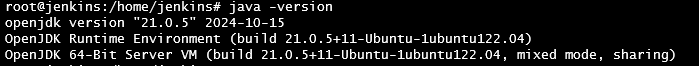

### Prasyarat untuk Menginstal Jenkins di Ubuntu 22.04  

Sebelum menginstal Jenkins di Ubuntu 22.04, pastikan sistem Anda memenuhi prasyarat berikut:  

1. **Memiliki Akses Root atau Sudo**  
   - Pastikan Anda memiliki akses sebagai pengguna dengan hak sudo untuk menginstal paket dan mengelola layanan.  

2. **Memperbarui Sistem**  
   - Jalankan perintah berikut untuk memperbarui daftar paket:  
     ```bash
     sudo apt update && sudo apt upgrade -y
     ```  

3. **Menginstal Java (JDK 21)**  
   - Jenkins memerlukan Java untuk berjalan. Instal OpenJDK dengan perintah:  
     ```bash
     sudo apt install openjdk-21-jdk -y
     ```  
   - Verifikasi instalasi Java:  
     ```bash
     java -version
     ```  
     

5. **Menambahkan Repository Jenkins**  
   - Tambahkan kunci GPG dan repositori resmi Jenkins:  
     ```bash
     sudo wget -O /usr/share/keyrings/jenkins-keyring.asc https://pkg.jenkins.io/debian-stable/jenkins.io-2023.key
     ```

     ```bash
     echo "deb [signed-by=/usr/share/keyrings/jenkins-keyring.asc]" https://pkg.jenkins.io/debian-stable binary/ | sudo tee \
     /etc/apt/sources.list.d/jenkins.list > /dev/null
     ```  

   - Perbarui daftar paket setelah menambahkan repositori:  
     ```bash
     sudo apt update -y
     ```  

### Install Jenkins di Ubuntu 22.04

1. **Install Jenkins**  
   - Untuk menginstal Jenkins, jalankan perintah berikut:
     ```bash
     sudo apt install jenkins -y
     ```

2. **Jalankan Service Jenkins**  
   - Setelah terinstal, mulai dan aktifkan layanan Jenkins:  
     ```bash
     sudo systemctl start jenkins && sudo systemctl enable jenkins
     ```

3. **Cek Status Service Jenkins**  
   - Untuk memeriksa status layanan:  
     ```bash
     sudo systemctl status jenkins
     ```
     

### Menyelesaikan Instalasi Jenkins di Ubuntu 22.04

1. **Buka Jenkins di Browser**  
   - Akses Jenkins melalui browser dengan alamat:
     ```bash
     http://<your-ip>:8080
     ```

2. **Dapatkan Password Awal**  
   - Saat pertama kali mengakses Jenkins, Anda akan diminta memasukkan password awal.
   - Dapatkan password tersebut dengan menjalankan perintah berikut:
     ```bash
     cat /var/lib/jenkins/secrets/initialAdminPassword
     ```
     

3. **Install Plugin**  
   - Kemudian klik tab "Install suggested plugins".
   
     

   - Instalasi Jenkins bersama dengan plugin yang disarankan akan dimulai.
     

4. **Membuat User**  
   - Setelah instalasi selesai, Anda akan diminta untuk memasukkan nama pengguna, kata sandi, nama lengkap, dan email Anda.
     

5. **Jenkins URL**  
   - Setelah menyimpan kredensial ini, jendela berikutnya akan menjadi URL aplikasi Anda. Jendela ini untuk mengonfirmasi apakah domain sudah benar dalam konfigurasi Apache. Klik tombol "Save and Finish".
     

5. **Jenkins Siap Digunakan**  
   - Setelah ini, akan ada tombol untuk "Start using Jenkins". Klik tombol itu dan Anda akan diarahkan ke situs web Administrator Jenkins.
     
   
     
